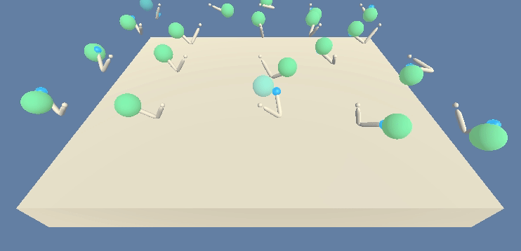

# Project 2: Reacher

### Introduction

For this project, I have trained an agent for solving a continous control problem: move a 2 sections joined arm to a target area.



In this environment, a double-jointed arm can move to target locations. A reward of +0.1 is provided for each step that the agent's hand is in the goal location. Thus, the goal of your agent is to maintain its position at the target location for as many time steps as possible.

The **observation space consists of 33 variables corresponding to position, rotation, velocity, and angular velocities of the arm**. Each **action is a vector with four numbers, corresponding to torque applicable to two joints**. Every entry in the action vector should be a number between -1 and 1.

**There are 2 versions of this environment**: the first version contains a single agent.
The second version contains 20 identical agents, each with its own copy of the environment.

I have chosen the second one that is useful for algorithms like PPO, A3C, and D4PG that use multiple (non-interacting, parallel) copies of the same agent to distribute the task of gathering experience.

The barrier for **solving the second version** of the environment is slightly different, to take into account the presence of many agents. In particular, your agents must get an average score of +30 (over 100 consecutive episodes, and over all agents). Specifically,

After each episode, we add up the rewards that each agent received (without discounting), to get a score for each agent. This yields 20 (potentially different) scores. We then take the average of these 20 scores.


### Installation and execution

I have used Linux. You can download the version for your SO, but remember to point to your Reacher environment folder:

```env = UnityEnvironment(file_name="Reacher_Linux_20/Reacher.x86_64")```

There are 2 available versions: 1 arm and 20 arms in parallel. Is you may notice, the notebook (*Reacher_Linux_**20***) containing the solution is calling to the 20 arms environment.

Installation steps:

1. Download the environment from one of the links below.  You need only select the environment that matches your operating system:
    - Linux: [click here](https://s3-us-west-1.amazonaws.com/udacity-drlnd/P1/Banana/Banana_Linux.zip)
    - Mac OSX: [click here](https://s3-us-west-1.amazonaws.com/udacity-drlnd/P1/Banana/Banana.app.zip)
    - Windows (32-bit): [click here](https://s3-us-west-1.amazonaws.com/udacity-drlnd/P1/Banana/Banana_Windows_x86.zip)
    - Windows (64-bit): [click here](https://s3-us-west-1.amazonaws.com/udacity-drlnd/P1/Banana/Banana_Windows_x86_64.zip)
    
    (_For Windows users_) Check out [this link](https://support.microsoft.com/en-us/help/827218/how-to-determine-whether-a-computer-is-running-a-32-bit-version-or-64) if you need help with determining if your computer is running a 32-bit version or 64-bit version of the Windows operating system.

    (_For AWS_) If you'd like to train the agent on AWS (and have not [enabled a virtual screen](https://github.com/Unity-Technologies/ml-agents/blob/master/docs/Training-on-Amazon-Web-Service.md)), then please use [this link](https://s3-us-west-1.amazonaws.com/udacity-drlnd/P1/Banana/Banana_Linux_NoVis.zip) to obtain the environment.

2. Place the file in the unziped folder, and unzip (or decompress) the file.

3. Create a virtual environment with anaconda and install packages: ```conda env create -f environment.yml```.

4. Activate the virtual environment: ```source activate <name of the env>```.

5. Install more packages:

Due to issues with conda, not only environment.yml is provided. Another file (requirements.txt) is also attached and should be taken into account.

Next with pip: ```pip install -r requirements.txt```

6. Launch jupyter notebook: ```jupyter notebook Navigation.ipynb```

7. Execute cells: just first cell (for imports).

Then, load the environment (in section number 4 "It's your turn"):

```
env = UnityEnvironment(file_name="Reacher_Linux_20/Reacher.x86_64")
```

Finally, execute the following cells to start training and finally plot the learning process. You should find something similar to this figure:


Where the blue line in the middle is the average score (taking into account the 20 arms) for every episode. It is located between the min and max scores in episode area. And the dashed black horizontal line is the target threshold.

### Model

You can read the full report in [Report.md](Report.md) (also available in this repo).

Thank you!