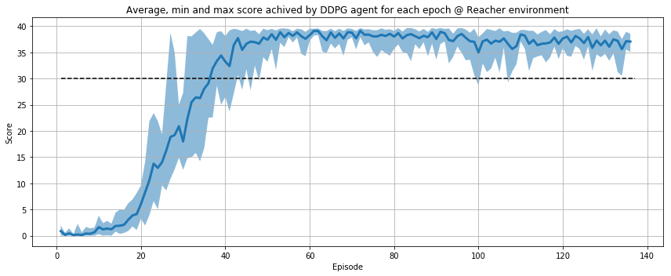

# Report

## Learning Algorithm

### Deep Deterministic Policy Gradient (DDPG)

Between different algorithms in the Policy Gradient family, DDPG has been chosen. DDPG is an model-free and off-policy method (to avoid sample inefficiency as in A3C) that let us train using a replay buffer of collected `(s, a, r, s', d)` tuples as in the DQN approach.

In essence, it is composed by 2 networks:

 - Actor: takes the state as input and gives us a continuous value for each action (4 in this case).
 
 - Critic: that not only takes the state, but also the Actor's actions and delivers a single Q-value.
 
 In the learning stage, the critic follows the Bellman equation update. While the actor uses the critics output for computing the loss. 
 
Some improvements have been done to make learning more stable: gradient clipping, soft target update (using local and target networks for both the actor and the critic) and a replay buffer.

### Model

As mentioned before, we have 2 twin networks: a local and a target for the actor and a local and a target for the critic.

The actor maps the 33 inputs to 256, then to 128 and finally to 4 outputs using ReLU as activation functions with the exception of the last layer that has a tanh because actions are bounded between -1 and 1. Batch normalization has been introduced in order to help to stabilize the learning.

The critic network takes the 33 input applies batch normalization and concatenates the output to the actions predicted by the actor. Then these values are mapped to 256, then to 128 and finally to 1 (the Q-value). Once more, ReLU has been selected as activation function with the exception of the last layer where a linear activation function has been used (to allow negative values).

### Hyperparameters

Both optimizers start with a 1e-3 learning rate using soft updates to the target network with tau 1e-3. With mini batches of 1024 samples.

The discount factor used to update the critic network is .99.

Finally, the size of the replay buffer is 1e6.

## Plot of Rewards

The following plot represents the average (blue line), max and min (area) scores of the 20 arms for every episode.

The goal is to  to receive an average reward (over 100 episodes, and over all 20 agents) of at least +30.

It has been **achieved in episode 37**, where the average line is above the dashed black horizontal line (the target threshold).

Both models (actor and critic) have been checkpointed to `actor_weights.pth` and `critic_weights.pth`.

## Future Work

First, an implementation of Soft Actor Critic (SAC) for the control problem. SAC is more robust to changes in Hyperparameters because it seeks to maximize not only the reward, but also the entropy of the policy.

Finally, D4GP would be another interesting point to try.